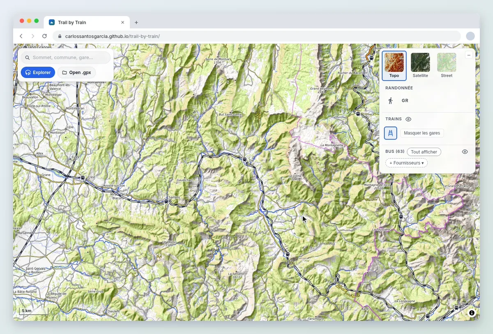
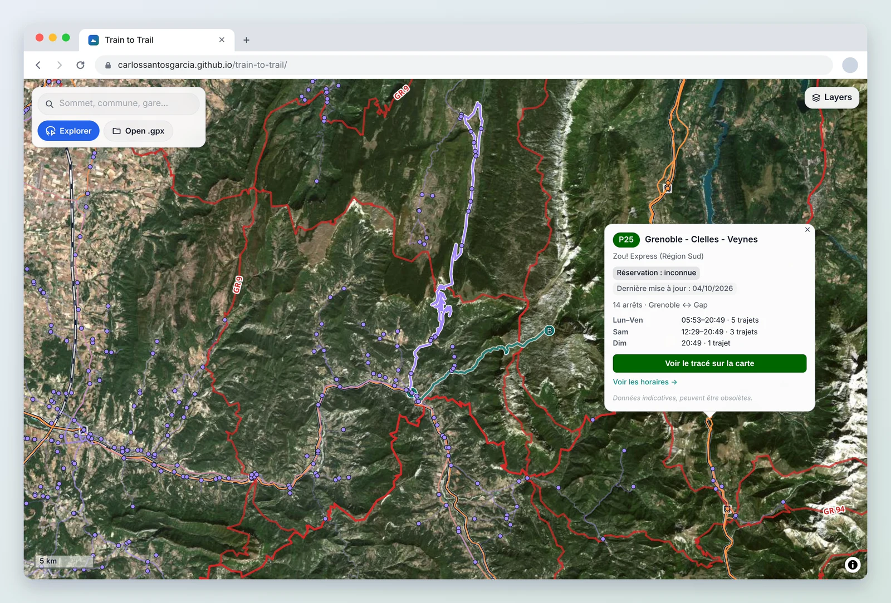
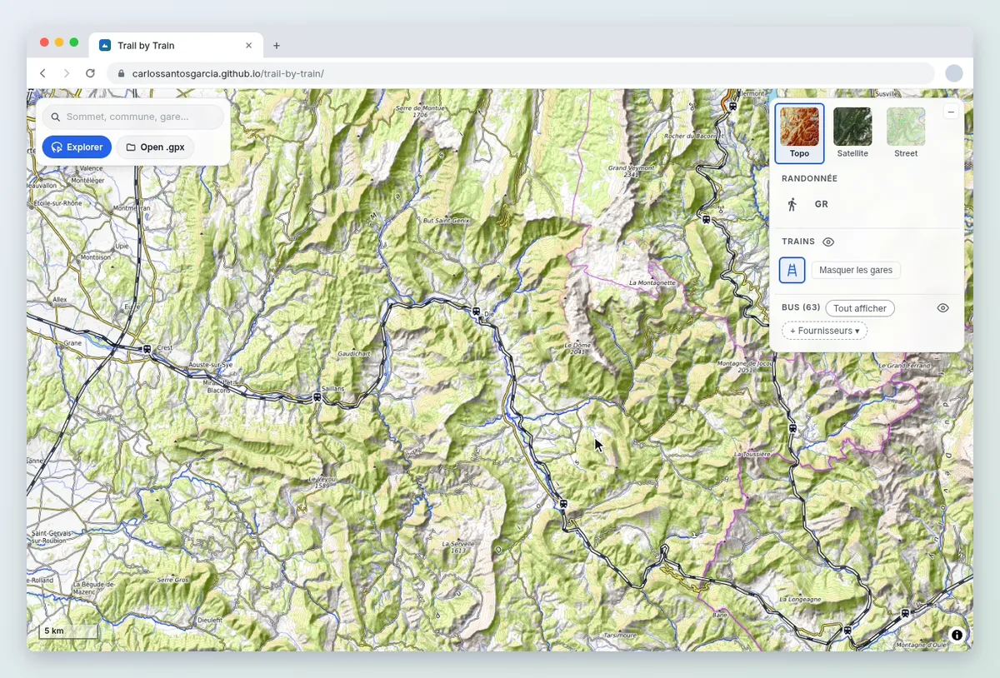
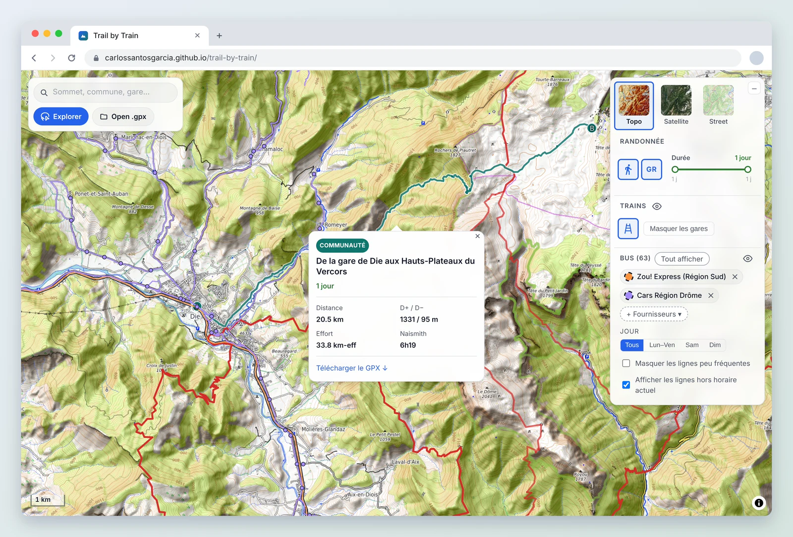
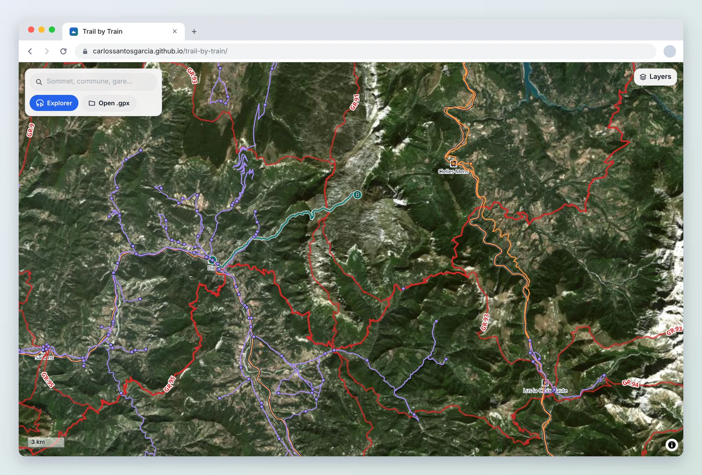
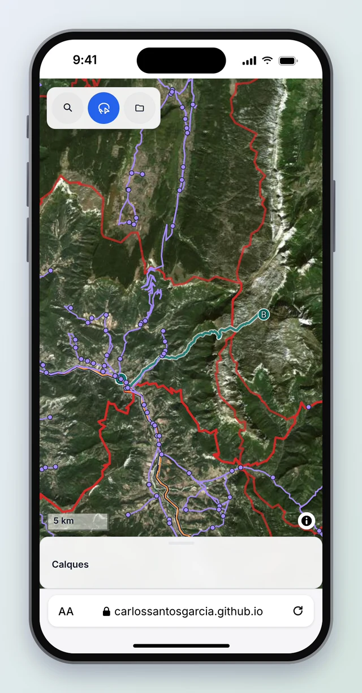

<!-- Logo: add docs/media/logo.svg, then uncomment.
<p align="center">
  <a href="https://carlossantosgarcia.github.io/trail-by-train/">
    
  </a>
</p>
-->

<h1 align="center">Trail by Train</h1>

<p align="center"><b>Hiking in nature, by train and bus</b></p>

<p align="center">
  Trains, buses, trails and terrain on one map.<br />Everything you need to plan your next day outside.
</p>

<p align="center">
  <a href="https://carlossantosgarcia.github.io/trail-by-train/"><b>Open the map</b></a> ·
  <a href="#what-you-can-do">What you can do</a> ·
  <a href="CONTRIBUTING.md">Contribute</a>
</p>

<p align="center">
  <a href="https://github.com/carlossantosgarcia/trail-by-train/actions/workflows/ci.yml"></a>
  <a href="https://github.com/carlossantosgarcia/trail-by-train/actions/workflows/data.yml"></a>
  <a href="LICENSE"></a>
</p>

<p align="center">
  
</p>
<p align="center"><sub>Draw a zone on the map and see every bus line, station and hike inside it.</sub></p>

Planning a day in the mountains usually means a lot of tabs: a topographic map,
the regional bus website, the train app, a blog post, a GPX file a friend sent
you. Trail by Train puts all of it on one map, so you can look at a valley and
see right away how to get there, which paths go where, and how long the day
will be.

It runs in your browser, needs no account, and is free and open source.

## What you can do

### Explore around any place

Draw around the valley you have in mind, or pick a place and choose how far
you're willing to go. Trail by Train lists everything inside: bus lines with
their own colours, train stations, and hikes. Hide the rest of the map and plan
from there.

### Find out if the bus actually runs



Click any line to see when it runs on weekdays, Saturdays and Sundays, how many
trips there are, and whether you need to book. A link
takes you to the operator's timetable. Regional coaches, valley shuttles and
ski-resort buses from all over France are on the map, refreshed every week from
the official open data.

### Bring your own tracks



Drop a GPX file on the map to see the route, its elevation profile and an
estimate of the effort (Naismith, Tobler, Minetti). Move along the profile and
the map follows. Tracks without altitude get it from IGN's terrain model. Your
files never leave your browser.

### Discover hikes worth taking



Hikes shared by the people who walked them, starting from a station or a bus
stop, with distance, climb, a time estimate and the GPX to take with you. Filter
them by number of days, or switch on the GR long-distance trails to see where a
route can take you next.

### On any map, on any screen

<table>
  <tr>
    <td></td>
    <td width="30%"></td>
  </tr>
</table>

Switch between topographic, satellite and street maps. Everything works on a
phone too, which is where you'll want it when you're standing at the bus stop.

## Where the data comes from

Everything on the map is open data, credited in the map itself: train lines and
stations from SNCF, bus and coach timetables published by the regions on
[transport.data.gouv.fr](https://transport.data.gouv.fr/), trails from
[OpenStreetMap](https://www.openstreetmap.org/), satellite imagery and altitude
from [IGN](https://geoservices.ign.fr/), and the topographic map from
[OpenTopoMap](https://opentopomap.org/). Timetables are rebuilt every week. The
full list, with licences, is in [DATA_LICENSES.md](DATA_LICENSES.md).

## Run it yourself

You need [Node.js](https://nodejs.org/) 20 or later.

```bash
git clone https://github.com/carlossantosgarcia/trail-by-train.git
cd trail-by-train
npm ci
npm run data:download   # the latest maps and timetables
npm run dev             # → http://localhost:1002
```

<details>
<summary>Rebuild the data from its sources instead</summary>

Each dataset has a script that downloads it from its source and prepares it for
the map. You'll need `tippecanoe`, `jq` and `unzip`
(`apt install tippecanoe jq unzip` or `brew install tippecanoe jq`).

```bash
npm run build:rail                 # SNCF lines and stations
npm run build:transit -- <network> # one bus network, or build:transit:all
npm run build:gr                   # GR trails from OpenStreetMap
npm run build:search               # the place search index
```

The [Data workflow](.github/workflows/data.yml) runs the same scripts every week
and publishes the result as the
[`data-latest`](https://github.com/carlossantosgarcia/trail-by-train/releases/tag/data-latest)
release.

</details>

<details>
<summary>Host your own copy</summary>

The app is a static site. `npm run build` writes it to `dist/`; serve that folder
with any web server that supports range requests (most do). Set
`VITE_BASE_PATH=/your/sub-path/` when it isn't served from the root. A
`Dockerfile` with an nginx setup is included.

</details>

## Contributing

There's plenty to do, and much of it needs no code: tell us when a bus line is
wrong, suggest a network that's missing, or share a hike you've walked. Code is
welcome too. [CONTRIBUTING.md](CONTRIBUTING.md) explains how to get started.

## Licence

The code is [MIT](LICENSE). The data belongs to its publishers and keeps their
licences; see [DATA_LICENSES.md](DATA_LICENSES.md). GR® is a trademark of the
FFRandonnée, which is not affiliated with this project.
